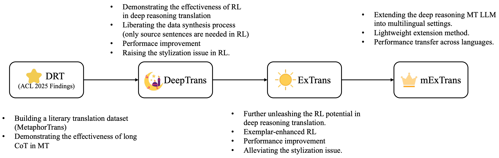
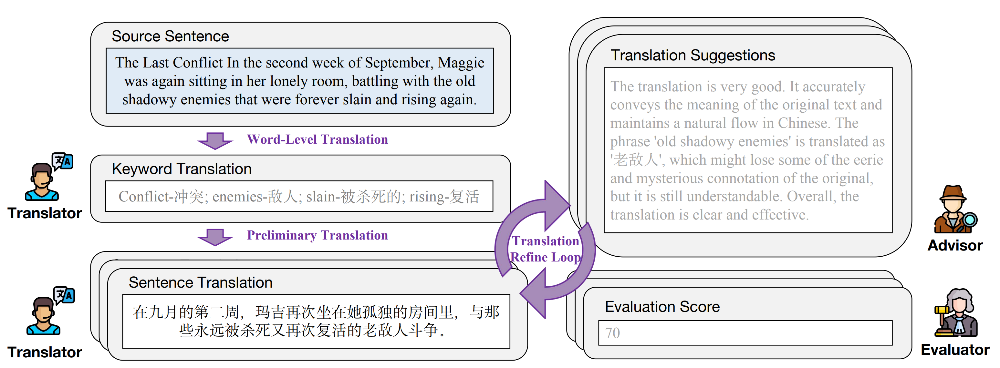
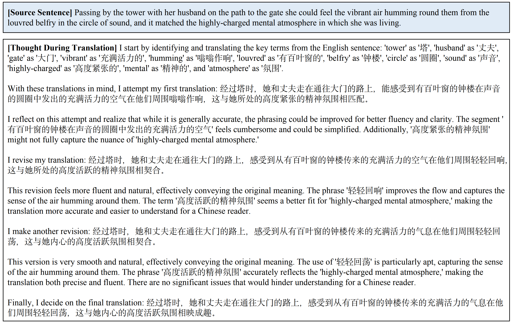
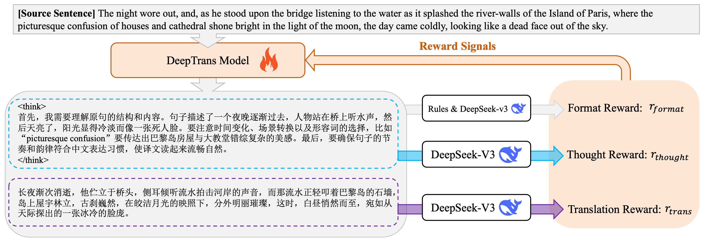
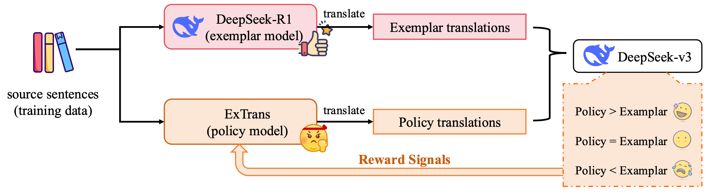

# Deep Reasoning Translation (DRT) Project

<p align="center">
🤗 <a href="https://huggingface.co/Krystalan/DRT-7B">DRT-7B</a>&nbsp&nbsp | &nbsp&nbsp🤗 <a href="https://huggingface.co/Krystalan/DRT-8B">DRT-8B</a>&nbsp&nbsp | &nbsp&nbsp🤗 <a href="https://huggingface.co/Krystalan/DRT-14B">DRT-14B</a>&nbsp&nbsp | &nbsp&nbsp 🤗 <a href="https://huggingface.co/Krystalan/DeepTrans-7B">DeepTrans-7B</a> | &nbsp&nbsp 🤗 <a href="https://huggingface.co/Krystalan/ExTrans-7B">ExTrans-7B</a> | &nbsp&nbsp 🤗 <a href="https://huggingface.co/Krystalan/mExTrans-7B">mExTrans-7B</a>

</p>

This repository contains the resources for our work:
- [**DeepTrans**: Deep Reasoning Translation via Reinforcement Learning](https://arxiv.org/abs/2504.10187) (**TACL 2025**)  
- [**DRT**: Deep Reasoning Translation via Long Chain-of-Thought](https://arxiv.org/abs/2412.17498) (**ACL 2025 Findings**)  
- [**ExTrans**: Multilingual Deep Reasoning Translation via Exemplar-Enhanced Reinforcement Learning](https://arxiv.org/abs/2505.12996) (arXiv preprint 2025)


Our exploration route is as follows:



### Updates:
- *2025.08.21*: Our [DeepTrans paper](https://arxiv.org/abs/2504.10187) is accepted to **TACL**.
- *2025.05.27*: We released the full data of our DRT work, including the synthesized thought contents and translations. Please refer to `data/MetaphorTrans_*.jsonl`
- *2025.05.19*: We released [ExTrans paper](https://arxiv.org/abs/2505.12996) with 🤗 <a href="https://huggingface.co/Krystalan/ExTrans-7B">ExTrans-7B</a> and 🤗 <a href="https://huggingface.co/Krystalan/mExTrans-7B">mExTrans-7B</a>. Check it out!
- *2025.05.16*: Our [DRT paper](https://arxiv.org/abs/2412.17498) is accepted to **ACL 2025 Findings**.
- *2025.04.14*: We released [DeepTrans paper](https://arxiv.org/abs/2504.10187) with 🤗 <a href="https://huggingface.co/Krystalan/DeepTrans-7B">DeepTrans-7B</a>. Check it out!
- *2024.12.31*: We updated [DRT paper](https://arxiv.org/abs/2412.17498) with more detals and analyses. Check it out!
- *2024.12.24*: We released [DRT paper](https://arxiv.org/abs/2412.17498) with 🤗 <a href="https://huggingface.co/Krystalan/DRT-7B">DRT-7B</a>, 🤗 <a href="https://huggingface.co/Krystalan/DRT-8B">DRT-8B</a> and 🤗 <a href="https://huggingface.co/Krystalan/DRT-14B">DRT-14B</a>. Check it out!


If you find this work is useful, please consider cite our paper:
```
@article{wang2025deeptrans,
  title={Deep Reasoning Translation via Reinforcement Learning},
  author={Wang, Jiaan and Meng, Fandong and Zhou, Jie},
  journal={arXiv preprint arXiv:2504.10187},
  year={2025}
}
```

```
@inproceedings{wang-etal-2025-drt,
    title = "{DRT}: Deep Reasoning Translation via Long Chain-of-Thought",
    author = "Wang, Jiaan  and
      Meng, Fandong  and
      Liang, Yunlong  and
      Zhou, Jie",
    editor = "Che, Wanxiang  and
      Nabende, Joyce  and
      Shutova, Ekaterina  and
      Pilehvar, Mohammad Taher",
    booktitle = "Findings of the Association for Computational Linguistics: ACL 2025",
    month = jul,
    year = "2025",
    address = "Vienna, Austria",
    publisher = "Association for Computational Linguistics",
    url = "https://aclanthology.org/2025.findings-acl.351/",
    doi = "10.18653/v1/2025.findings-acl.351",
    pages = "6770--6782",
    ISBN = "979-8-89176-256-5"
}
```

```
@article{wang2025extrans,
  title={ExTrans: Multilingual Deep Reasoning Translation via Exemplar-Enhanced Reinforcement Learning},
  author={Wang, Jiaan and Meng, Fandong and Zhou, Jie},
  journal={arXiv preprint arXiv:2505.12996},
  year={2025}
}
```

# Quick Links
- [DRT: Deep Reasoning Translation via Long Chain-of-Thought (ACL 2025 Findings)](#drt)
    - [Introduction](#introduction)
    - [Models](#models)
        - [Model Access](#model-access)
        - [Model Performance](#model-performance)
        - [Model Prompts](#model-prompts)
        - [Quickstart](#quickstart)
    - [Translation Cases](#translation-cases)
    - [Data (MetaphorTrans)](#data)
- [DeepTrans: Deep Reasoning Translation via Reinforcement Learning (TACL)](#deeptrans)
    - [Model Checkpoint](#model-checkpoint)
    - [Inference](#inference)
    - [Data](#book-data)
- [ExTrans: Multilingual Deep Reasoning Translation via Exemplar-Enhanced Reinforcement Learning](#extrans)
    - [ExTrans-7B inference](#inference-of-extrans)
    - [mExTrans-7B inference](#inference-of-mextrans)
- [License](#license)

# DRT

## Introduction




In this work, we introduce DRT, an attempt to bring the success of long thought reasoning to neural machine translation (MT). To this end,
- 🌟 We mine English sentences with similes or metaphors from existing literature books, which are suitable for translation via long thought.
- 🌟 We propose a designed multi-agent framework with three agents (i.e., a translator, an advisor and an evaluator) to synthesize the MT samples with long thought. There are 22,264 synthesized samples in total.
- 🌟 We train DRT-8B, DRT-7B and DRT-14B using Llama-3.1-8B-Instruct, Qwen2.5-7B-Instruct and Qwen2.5-14B-Instruct as backbones.

> Our goal is not to achieve competitive performance with OpenAI’s O1 in neural machine translation (MT). Instead, we explore technical routes to bring the success of long thought to MT. To this end, we introduce DRT, *a byproduct of our exploration*, and we hope it could facilitate the corresponding research in this direction.




## Models

### Model Access

|  | Backbone | Model Access |
| :--: | :--: | :--: |
| DRT-7B | 🤗 <a href="https://huggingface.co/Qwen/Qwen2.5-7B-Instruct">Qwen2.5-7B-Instruct</a> | 🤗 <a href="https://huggingface.co/Krystalan/DRT-7B">DRT-7B</a> |
| DRT-8B | 🤗 <a href="https://huggingface.co/meta-llama/Llama-3.1-8B-Instruct">Llama-3.1-8B-Instruct</a> | 🤗 <a href="https://huggingface.co/Krystalan/DRT-8B">DRT-8B</a> |
| DRT-14B | 🤗 <a href="https://huggingface.co/Qwen/Qwen2.5-14B-Instruct">Qwen2.5-14B-Instruct</a> | 🤗 <a href="https://huggingface.co/Krystalan/DRT-14B">DRT-14B</a> |

### Model Performance
|  | GRF | CometKiwi | GRB | BLEU | CometScore |
| :--: | :--: | :--: | :--: | :--: | :--: |
| Llama-3.1-8B-Instruct | 79.25 | 70.14 | 73.30 | 18.55 | 74.58 |
| Qwen2.5-7B-Instruct | 81.53 | 70.36 | 77.92 | 27.02 | 76.78 |
| Qwen2.5-14B-Instruct | 84.74 | 72.01 | 80.85 | 30.23 | 78.84 |
| Marco-o1-7B | 82.41 | 71.62 | 77.50 | 29.48 | 77.41 |
| QwQ-32B-preview | 86.31 | 71.48 | 83.08 | 27.46 | 78.68 |
| DRT-8B | 84.49 | 70.85 | 80.80 | 32.67 | 78.81 |
| DRT-7B | 85.57 | 71.78 | 82.38 | 35.54 | 80.19 |
| DRT-14B | **87.19** | **72.11** | **83.20** | **36.46** | **80.64** |


### Model Prompts
During model inference, please use the following prompts:
- System prompt: `You are a philosopher skilled in deep thinking, accustomed to exploring complex problems with profound insight.`
- User prompt: `Please translate the following text from English to Chinese:\n[An English text]`

DRT models will first generate the thought and then provide the final translation, with the following format:
```
<thought>
[Reasoning process]
</thought>
<output>
[Final translation]
</output>
```

### Quickstart
- ⛷️ Huggingface Transformers:

```python
from transformers import AutoModelForCausalLM, AutoTokenizer

model_name = "Krystalan/DRT-7B"

model = AutoModelForCausalLM.from_pretrained(
    model_name,
    torch_dtype="auto",
    device_map="auto"
)
tokenizer = AutoTokenizer.from_pretrained(model_name)

prompt = "Please translate the following text from English to Chinese:\nThe mother, with her feet propped up on a stool, seemed to be trying to get to the bottom of that answer, whose feminine profundity had struck her all of a heap."
messages = [
    {"role": "system", "content": "You are a philosopher skilled in deep thinking, accustomed to exploring complex problems with profound insight."},
    {"role": "user", "content": prompt}
]
text = tokenizer.apply_chat_template(
    messages,
    tokenize=False,
    add_generation_prompt=True
)
model_inputs = tokenizer([text], return_tensors="pt").to(model.device)

generated_ids = model.generate(
    **model_inputs,
    max_new_tokens=2048
)
generated_ids = [
    output_ids[len(input_ids):] for input_ids, output_ids in zip(model_inputs.input_ids, generated_ids)
]

response = tokenizer.batch_decode(generated_ids, skip_special_tokens=True)[0]
print(response)
```

- ⛷️ vllm:

Deploying LLMs:
```bash
python3 -m vllm.entrypoints.openai.api_server --model [model_ckpt] --served-model-name [model_name]
```

Calling LLMs:
```python
from openai import OpenAI
# Set OpenAI's API key and API base to use vLLM's API server.
openai_api_key = "EMPTY"
openai_api_base = "http://localhost:8000/v1"

client = OpenAI(
    api_key=openai_api_key,
    base_url=openai_api_base,
)

chat_response = client.chat.completions.create(
    model=[model_name],
    messages=[
        {"role": "system", "content": "You are a philosopher skilled in deep thinking, accustomed to exploring complex problems with profound insight."},
        {"role": "user", "content": "Please translate the following text from English to Chinese:\nThe mother, with her feet propped up on a stool, seemed to be trying to get to the bottom of that answer, whose feminine profundity had struck her all of a heap."},
    ],
    temperature=0.1,
    top_p=0.8,
    max_tokens=2048,
    extra_body={
        "repetition_penalty": 1.05,
    },
)
print("Chat response:", chat_response)
```

## Translation Cases

| Source Sentence | Qwen2.5-14B-Instruct | QwQ-32B-preview | DRT-14B |
| :--: | :--: | :--: | :--: |
|Women were weeping and children crying, and all were going as fast as seemingly lay in their power, looking behind now and then as if pursued by some deadly enemy. | 妇女在哭泣，孩子们在哀号，所有人都似乎在尽全力快速前行，不时回头张望，仿佛背后有某个致命的敌人在追赶。 | 妇女们哭泣着，孩子们哭喊着，每个人都在尽力加快脚步，不时回头张望，仿佛背后有致命的敌人在追击。 | 妇女悲泣，孩童哀号，众人疾奔，不时回首，仿佛有致命之敌在后紧追。 |
|Wait through this season of the rain Till suns of autumn dry the plain, Then shall thy giant foe, and all His host and realm, before thee fall. | 等待这雨季过去，直到秋日的阳光晒干原野，那时你的巨敌及其部众和王国都将倒在你面前。 | 忍过雨季漫长夜，待秋阳升空，晒干大地湿润色，那时，巨敌垮台，他的军队和王国，全在你脚下。 | 历尽这雨季，待秋日阳光驱散平原上的最后一丝湿润，那时，你那巨敌，连同他的军队与王国，都将匍匐在你脚下。 |
|And if their words had taken another turn...if he himself had been less fastidious about intruding on another man's secrets...it was cruel to think how thin a film had shut out rescue from all this guilt and misery. | 而如果他们的言辞转向了另一个方向……如果他自己对侵扰他人秘密不那么介意……想到正是那层薄薄的隔阂将救援拒之门外，使得这一切的罪恶和痛苦无法避免，真是残酷。 | 而且，假如他们的谈话走向不同……假如他自己不对干涉他人私事如此谨慎……那时他会意识到，只要一层薄薄的屏障就阻隔了救援，使得所有这些罪恶和痛苦无法解脱，这真是残忍。 | 若他们的言辞稍作转变……若他本人不那么介意侵入他人的心扉……想到这层薄薄的隔阂竟将所有内疚与痛苦隔离于救援之外，实为残忍。 |
|This cold officer upon a monument, who dropped epithets unconcernedly down, would be finer as a dead man, he thought. | 他认为，这个站在纪念碑上的冷漠官员，若死了会更好，他不带任何感情地抛下了一些称呼。 | 这个冷冰冰的官员站在纪念碑上，毫不在意地抛下一些称号，他想，如果作为一个死人会更出色。 | 纪念碑上的冷淡官员，漫不经心地吟咏那些修饰语，他心想，若化为亡者，或许更显尊贵。 |


## Data

We release the synthesized data (named ```MetaphorTrans```), please refer to `data/MetaphorTrans_*.jsonl`, where `text` and `trans` denote the source English sentences and the target Chinese translations, respectively. `thought` indicates the thought content for MT.


# DeepTrans



In this work, we propose DeepTrans-7B, which aims at enhancing the free translation ability of deep reasoning LLMs via RL. To this end, we use DeepSeek-v3 (671B) as the reward model, and design scoring criteria on both translations and thought process.

## Model Checkpoint

|  | Backbone | Model Access |
| :--: | :--: | :--: |
| DeepTrans-7B | 🤗 <a href="https://huggingface.co/Qwen/Qwen2.5-7B-Instruct">Qwen2.5-7B-Instruct</a> | 🤗 <a href="https://huggingface.co/Krystalan/DeepTrans-7B">DeepTrans-7B</a> |

## Inference

- Huggingface Transformers
```python
from transformers import AutoModelForCausalLM, AutoTokenizer

model_name = "Krystalan/DeepTrans-7B"

model = AutoModelForCausalLM.from_pretrained(
    model_name,
    torch_dtype="auto",
    device_map="auto"
)
tokenizer = AutoTokenizer.from_pretrained(model_name)

prompt = "你是一个翻译专家，擅长将英文翻译成中文。你在翻译过程中非常擅长思考，会先进行思考再给出翻译结果。你的输出格式为：\n<think>\n[思考过程]\n</think>[翻译结果]\n\n在你思考完之后，也就是</think>之后，你会给出最终的翻译即“[翻译结果]”，且[翻译结果]中不需要给出任何解释和描述，只需要提供英文的翻译结果。\n现在请你翻译以下这句英语：\n" + "The mother, with her feet propped up on a stool, seemed to be trying to get to the bottom of that answer, whose feminine profundity had struck her all of a heap."

messages = [
    {"role": "user", "content": prompt}
]
text = tokenizer.apply_chat_template(
    messages,
    tokenize=False,
    add_generation_prompt=True
)
model_inputs = tokenizer([text], return_tensors="pt").to(model.device)

generated_ids = model.generate(
    **model_inputs,
    max_new_tokens=2048
)
generated_ids = [
    output_ids[len(input_ids):] for input_ids, output_ids in zip(model_inputs.input_ids, generated_ids)
]

response = tokenizer.batch_decode(generated_ids, skip_special_tokens=True)[0]
print(response)
```

- VLLM:
deploying LLMs:
```bash
python3 -m vllm.entrypoints.openai.api_server --model [model_ckpt] --served-model-name [model_name]
```

calling LLMs:
```python
from openai import OpenAI
# Set OpenAI's API key and API base to use vLLM's API server.
openai_api_key = "EMPTY"
openai_api_base = "http://localhost:8000/v1"

client = OpenAI(
    api_key=openai_api_key,
    base_url=openai_api_base,
)

prompt = "你是一个翻译专家，擅长将英文翻译成中文。你在翻译过程中非常擅长思考，会先进行思考再给出翻译结果。你的输出格式为：\n<think>\n[思考过程]\n</think>[翻译结果]\n\n在你思考完之后，也就是</think>之后，你会给出最终的翻译即“[翻译结果]”，且[翻译结果]中不需要给出任何解释和描述，只需要提供英文的翻译结果。\n现在请你翻译以下这句英语：\n" + "The mother, with her feet propped up on a stool, seemed to be trying to get to the bottom of that answer, whose feminine profundity had struck her all of a heap."

chat_response = client.chat.completions.create(
    model=[model_name],
    messages=[
        {"role": "user", "content": prompt},
    ],
    temperature=0.1,
    top_p=0.8,
    max_tokens=2048,
    extra_body={
        "repetition_penalty": 1.05,
    },
)
print("Chat response:", chat_response)
```

## Book Data

We purchase electronic copies of two complete literature books, i.e., *The Essential O. Henry Collection* and *Orbital*, and evaluate model performance on these two books.

We released the content of *The Essential O. Henry Collection* at `data/ohenry.txt`. For the content of *Orbital*, we cannot release it due to copyright protection. If you indeed need the data **only for research purposes**, please send an application email to jawang.nlp[at]gmail.com to obtain it.

# ExTrans



In this work, we propose ExTrans-7B, which aims at enhancing the free translation ability of deep reasoning LLMs via **exemplar-enhanced** RL. In detail, for each training MT sample, we use DeepSeek-R1 (671B) to generate a exemplar translation, and compare the translation results of the policy model with the exemplar translations to provide rewards for the policy model.

Moreover, we extend ExTrans-7B from English-to-Chinese translation into **multilingual settings** with 11 languages, *e.g.*, Chinese, English, Arabic, Czech, German, Spanish, French, Italian, Japanese, Russian and Korean. 

The model checkpoints can be accessed from the following links:  
|  | Backbone | Model Access |
| :--: | :--: | :--: |
| ExTrans-7B | 🤗 <a href="https://huggingface.co/Qwen/Qwen2.5-7B-Instruct">Qwen2.5-7B-Instruct</a> | 🤗 <a href="https://huggingface.co/Krystalan/ExTrans-7B">ExTrans-7B</a> |
| mExTrans-7B | 🤗 <a href="https://huggingface.co/Qwen/Qwen2.5-7B-Instruct">Qwen2.5-7B-Instruct</a> | 🤗 <a href="https://huggingface.co/Krystalan/mExTrans-7B">mExTrans-7B</a> |


## Inference of ExTrans

deploying LLMs:
```bash
python3 -m vllm.entrypoints.openai.api_server --model [model_ckpt] --served-model-name [model_name]
```

calling LLMs:
```python
from openai import OpenAI
# Set OpenAI's API key and API base to use vLLM's API server.
openai_api_key = "EMPTY"
openai_api_base = "http://localhost:8000/v1"

client = OpenAI(
    api_key=openai_api_key,
    base_url=openai_api_base,
)

prompt = "你是一个翻译专家，擅长将英文翻译成中文。你在翻译过程中非常擅长思考，会先进行思考再给出翻译结果。你的输出格式为：\n<think>\n[思考过程]\n</think>[翻译结果]\n\n在你思考完之后，也就是</think>之后，你会给出最终的翻译即“[翻译结果]”，且[翻译结果]中不需要给出任何解释和描述，只需要提供英文的翻译结果。\n现在请你翻译以下这句英语：\n" + "The mother, with her feet propped up on a stool, seemed to be trying to get to the bottom of that answer, whose feminine profundity had struck her all of a heap."

chat_response = client.chat.completions.create(
    model=[model_name],
    messages=[
        {"role": "user", "content": prompt},
    ],
    temperature=0.1,
    top_p=0.8,
    max_tokens=2048,
    extra_body={
        "repetition_penalty": 1.05,
    },
)
print("Chat response:", chat_response)
```

## Inference of mExTrans

calling LLMs:
```python
from openai import OpenAI
# Set OpenAI's API key and API base to use vLLM's API server.
openai_api_key = "EMPTY"
openai_api_base = "http://localhost:8000/v1"

client = OpenAI(
    api_key=openai_api_key,
    base_url=openai_api_base,
)

lang2des = {
    "ar": "阿拉伯语", # Arabic
    "cs": "捷克语", # Czech
    "de": "德语", # German
    "en": "英语", # English
    "es": "西班牙语", # Spanish
    "fr": "法语", # French
    "it": "意大利语", # Italian
    "ja": "日语", # Japanese
    "ko": "韩语", # Korean
    "ru": "俄语", # Russian
    "zh": "中文" # Chinese
}

current_src_lang = lang2des["en"] # set the source language
current_trg_lang = lang2des["zh"] # set the target language

current_sent = "The mother, with her feet propped up on a stool, seemed to be trying to get to the bottom of that answer, whose feminine profundity had struck her all of a heap." # the source sentence to be translated

TRANS_PROMPT = "你是一个翻译专家，擅长将{current_src}翻译成{current_trg}。你在翻译过程中非常擅长思考，会先用中文进行思考再给出翻译结果。在你思考完之后，也就是</think>之后，你会给出最终的翻译，且最终的翻译结果中不需要给出任何解释和描述，只需要提供翻译结果。\n现在请你翻译以下这句{current_src}：\n{current_sent}"

chat_response = client.chat.completions.create(
    model=[model_name],
    messages=[
        {"role": "user", "content": TRANS_PROMPT.format(current_src=current_src_lang, current_trg=current_trg_lang, current_sent=current_sent)},
    ],
    temperature=0.1,
    top_p=0.8,
    max_tokens=2048,
    extra_body={
        "repetition_penalty": 1.05,
    },
)
print("Chat response:", chat_response)
```

Note that, the prompt of mExTrans is slightly different from that of ExTrans.

# License
This work is licensed under cc-by-nc-sa-4.0

